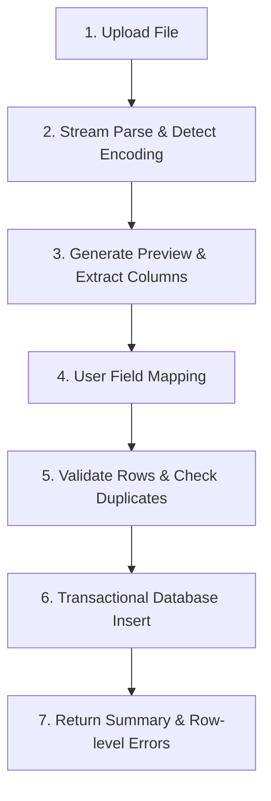

# Anki Data Handler Skill

## 1. Scope & Development Stages

NihongoAI adheres to Anki data compatibility while maintaining structured domain separation (Deck, Note, Card, Vocabulary, Grammar).

Implement in four distinct stages:
- **Stage 1:** Standard CSV import & export (UTF-8, comma-separated).
- **Stage 2:** TSV import & export (tab-separated).
- **Stage 3:** Interactive field mapping, tag management, and duplicate resolution policies.
- **Stage 4:** Advanced APKG package handling (SQLite collection unpack, media assets).

*Never attempt APKG packaging before CSV and TSV support is robustly tested.*

---

## 2. Text Encoding & Parser Requirements

### Encoding Rules
- Support **UTF-8** natively.
- Detect and strip **UTF-8 BOM** (`\uFEFF`) gracefully if present in Windows-generated files.
- Preserved characters:
  - Japanese: Kanji, Hiragana, Katakana, Punctuation (`。`, `、`, `「`, `」`).
  - Vietnamese: Diacritics (`á, à, ả, ã, ạ, ắ, ằ, ẵ, ặ, ấ, ầ, ẩ, ẫ, ậ, ê, ô, ơ, ư...`).
- Never perform lossy unicode normalization on original user learning content.

### Parser Rules
- **Prohibited:** Naive string splitting (e.g. `line.split(",")`).
- **Required:** Use a standard RFC-4180 compliant CSV parser (e.g. `Apache Commons CSV` or `OpenCSV`).
- Must handle:
  - Quotes escaping (`""`).
  - Embedded commas and semicolons inside quoted text.
  - Multi-line fields (line breaks inside quotes).

---

## 3. Import Workflow



### Detailed Steps:
1. **File Inspection:**
   - Detect delimiter (comma `,` or tab `\t`).
   - Check file size against safe limits (e.g. max 20MB for local desktop).
2. **Preview Generation:**
   - Parse the first 5–10 rows without saving.
   - Return column headers or indices along with sample values to the frontend.
3. **Field Mapping Interface:**
   - Let user map source columns to target fields:
     - `word` / `expression`
     - `reading` (hiragana/katakana)
     - `meaningVi` (Vietnamese meaning)
     - `exampleSentenceJa`
     - `exampleSentenceVi`
     - `tags` (comma or space separated)
4. **Duplicate Handling Policy:**
   - `SKIP`: Keep existing note, ignore new row.
   - `UPDATE`: Update fields of existing note.
   - `ALLOW_DUPLICATE`: Insert as a new independent note.
5. **Transactional Persistence:**
   - Execute batch inserts in a database transaction (`@Transactional`).
   - If an unrecoverable failure occurs, roll back completely.
   - For recoverable single-row errors, record the error with `rowNumber`, `offendingValue`, and `reason`, then proceed according to policy.
6. **Import Summary Response:**
   ```json
   {
     "totalRows": 250,
     "importedCount": 248,
     "skippedCount": 2,
     "errors": [
       {"rowNumber": 14, "reason": "Missing required field: word"},
       {"rowNumber": 89, "reason": "Malformed quotes"}
     ]
   }
   ```

---

## 4. Export Workflow

- **Encoding:** Output as UTF-8 (optionally with UTF-8 BOM for Excel compatibility if requested).
- **Format:** Configurable CSV or TSV.
- **Fields:** Export `word`, `reading`, `meaningVi`, `examples`, `tags`, and optionally SRS stats.
- **Round-Trip Guarantee:**
  - Exporting a deck to CSV and re-importing that CSV must yield identical learning notes without character corruption.

---

## 5. Verification Checklist

- [ ] Does the parser handle multiline cells without splitting them into separate rows?
- [ ] Are Vietnamese diacritics and Japanese Kanji preserved without `???` or Mojibake?
- [ ] Is input sanitized if HTML tags are present (preventing XSS in webview)?
- [ ] Are duplicate notes detected based on the configured policy?
- [ ] Does the UI display row-level error feedback to the user rather than generic error popups?
- [ ] Are automated tests provided for Japanese text, Vietnamese text, quotes, commas, and empty fields?
