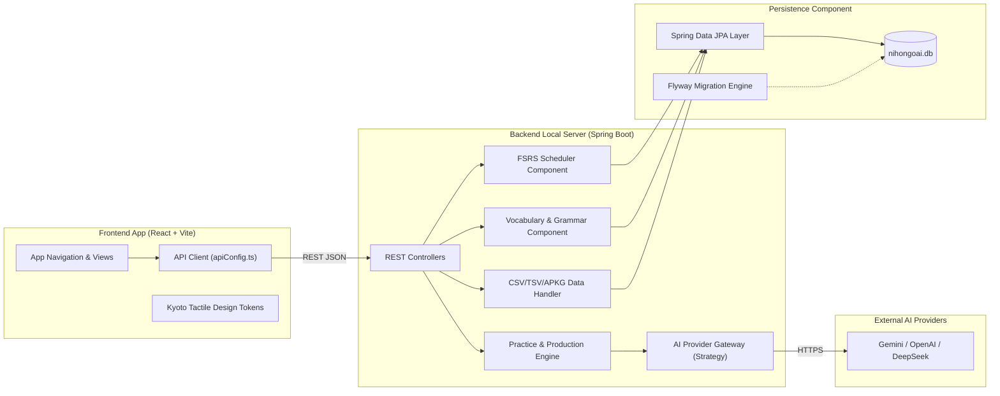
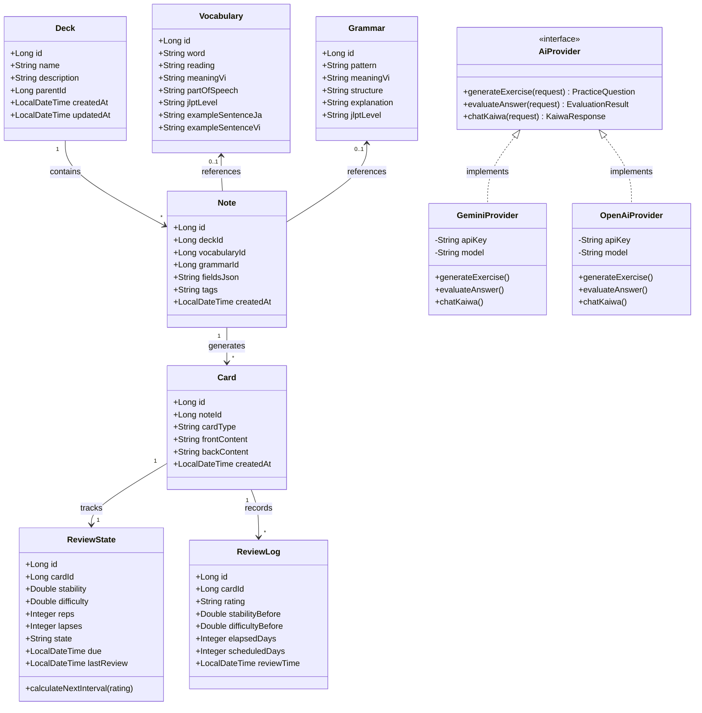
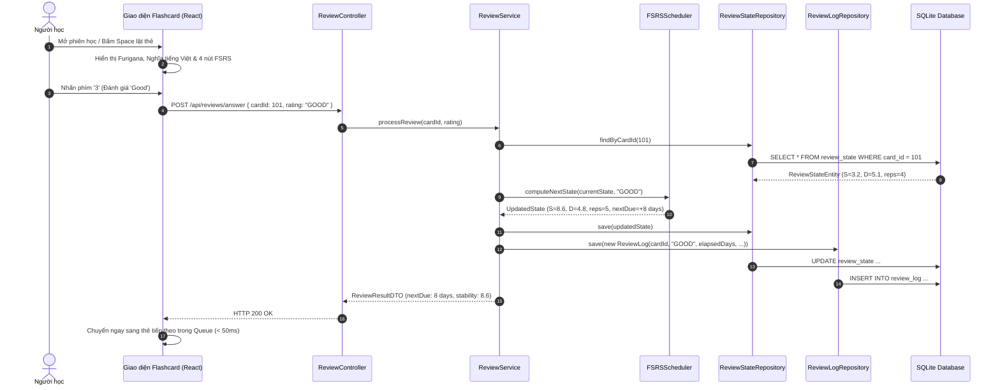
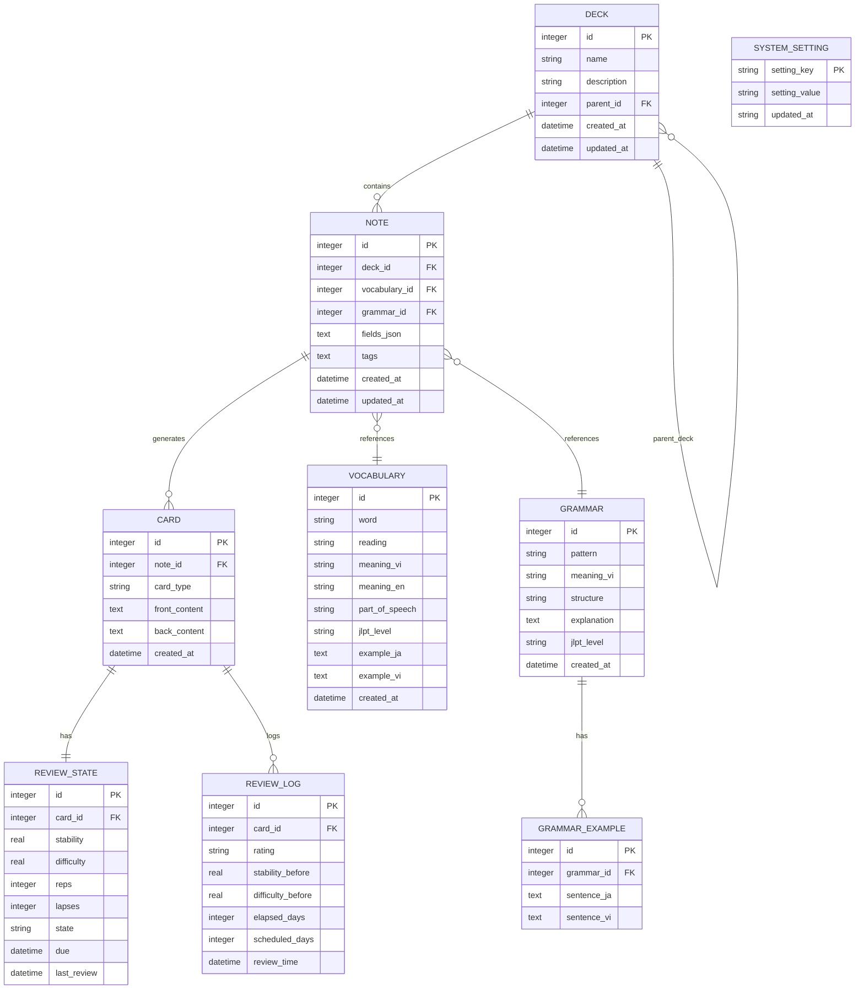

# Chương 5: AI trong Thiết kế & Kiến trúc Phần mềm
> **Dự án:** NihongoAI (Hệ thống Học Tiếng Nhật & Ôn Thẻ FSRS Hỗ Trợ AI)  
> **Tài liệu:** Đặc tả Thiết kế Kiến trúc Phần mềm (Software Architecture & System Design Specification)  
> **Phiên bản:** 1.0 — Chuẩn hóa cho Môi trường Desktop Local-First (Tauri 2 + Spring Boot + SQLite + AI)  
> **Trạng thái:** ĐÃ PHÊ DUYỆT (Official Architecture Baseline)

---

## 5.1 Thiết kế Kiến trúc (System Architecture)

### 5.1.1 Bối cảnh & Mục tiêu Kiến trúc
NihongoAI là ứng dụng phần mềm Desktop hoạt động theo nguyên tắc **Local-first**, kết hợp giữa:
1. Năng lực lưu trữ, quản trị dữ liệu và thuật toán lặp lại ngắt quãng (FSRS) độc lập, không phụ thuộc vào Internet.
2. Sức mạnh mở rộng của các mô hình ngôn ngữ lớn (LLM - Gemini / OpenAI / DeepSeek) để tạo ngữ cảnh học tập chủ động (sinh câu luyện dịch Việt $\rightarrow$ Nhật, chấm bài ngữ nghĩa và đàm thoại Kaiwa).

### 5.1.2 Sơ đồ Kiến trúc Tổng thể Hệ thống

```mermaid
graph TB
    subgraph DesktopClient ["LỚP DESKTOP SHELL (TAURI 2 & REACT)"]
        UI["React 19 + TypeScript + Vite\n(Kyoto Tactile Studio Design System)"]
        TauriShell["Tauri 2 Core (Rust Shell)\n- Window Lifecycle\n- Subprocess Sidecar Management\n- Native Dialog & File System"]
        UI <--> |IPC Calls / Events| TauriShell
    end

    subgraph LocalBackend ["LỚP XỬ LÝ NGHIỆP VỤ NỘI BỘ (SPRING BOOT 3.2 - JAVA 21)"]
        direction TB
        APIController["REST Controllers\n(Decks, Reviews, Vocab, Grammar, Practice, Kaiwa)"]
        ServiceLayer["Domain & Application Services\n(FSRS Engine, Import/Export, PracticeService)"]
        AiBridge["AI Provider Abstraction Layer\n(AiProvider Interface & Prompt Engineers)"]
        DataAccess["Spring Data JPA + Hibernate\n(HikariCP Connection Pool)"]
        
        APIController --> ServiceLayer
        ServiceLayer --> AiBridge
        ServiceLayer --> DataAccess
    end

    subgraph LocalStorage ["LỚP LƯU TRỮ CỤC BỘ (EMBEDDED SQLITE & FLYWAY)"]
        FlywayEngine["Flyway Schema Migrations\n(V1 -> V2 -> V3)"]
        SqliteDB[("SQLite Local Database\n(nihongoai.db)")]
        FlywayEngine -.-> |Duy trì cấu trúc CSDL| SqliteDB
        DataAccess <--> |JDBC Driver| SqliteDB
    end

    subgraph CloudAI ["LỚP DỊCH VỤ TRÍ TUỆ NHÂN TẠO ĐÁM MÂY (ONLINE AI SERVICES)"]
        GeminiAPI["Google Gemini Pro/Flash API"]
        OpenAiAPI["OpenAI GPT-4o API"]
        DeepSeekAPI["DeepSeek V3 Chat API"]
    end

    UI <--> |Local HTTP / REST (Loopback 127.0.0.1)| APIController
    AiBridge <--> |HTTPS TLS / Secure Key Header| GeminiAPI
    AiBridge <--> |HTTPS TLS / Secure Key Header| OpenAiAPI
    AiBridge <--> |HTTPS TLS / Secure Key Header| DeepSeekAPI
```

### 5.1.3 Ranh giới Môi trường & Nguyên tắc Phân chia (Offline-First Boundaries)
1. **Ranh giới Cục bộ Tuyệt đối (100% Offline Boundary):**
   * Quản lý Từ vựng, Ngữ pháp, Deck, Note, Card.
   * Lập lịch thuật toán FSRS (tính toán `Stability`, `Difficulty`, `Interval`, `Retrievability`).
   * Nhật ký ôn tập (Review Log), thống kê và biểu đồ tần suất học (Heatmap).
   * Nhập/xuất dữ liệu Anki (CSV/TSV/APKG).
   * *Cam kết:* Toàn bộ dữ liệu nằm trên thiết bị cá nhân của học viên; ứng dụng khởi động và ôn bài hoàn toàn không cần Internet.
2. **Ranh giới Mở rộng Trực tuyến (Online Cloud AI Boundary):**
   * Chỉ kích hoạt khi người dùng sử dụng tính năng **Luyện dịch câu AI** và **Hội thoại AI Kaiwa**.
   * Mọi yêu cầu gọi AI Cloud đều đi qua Spring Boot backend; giao diện React không bao giờ chứa API Key hay gọi thẳng nhà cung cấp AI.
   * Nếu mất mạng hoặc AI trả về lỗi, hệ thống tự động fallback về câu hỏi tĩnh và dữ liệu mẫu cục bộ, giữ nguyên trạng thái phiên học và không làm hỏng dữ liệu CSDL.

---

## 5.2 Các Mô hình Kiến trúc (Architecture Patterns)

Hệ thống kết hợp 4 mô hình kiến trúc chuẩn mực để đảm bảo tính module hóa, dễ bảo trì và mở rộng:

### 1. Kiến trúc Phân tầng (Layered Architecture)
Toàn bộ mã nguồn Backend Spring Boot tuân thủ cấu trúc 4 tầng nghiêm ngặt:
* **Presentation Layer (`controller/`, `dto/`):** Tiếp nhận yêu cầu HTTP từ React, kiểm tra tính hợp lệ của dữ liệu đầu vào (Bean Validation), chuyển đổi qua DTO, trả về HTTP status code phù hợp. Tuyệt đối không chứa query CSDL hay logic FSRS.
* **Service / Application Layer (`service/`, `practice/`, `srs/`):** Điều phối toàn bộ quy trình nghiệp vụ (quản lý giao dịch `@Transactional`, tính toán khoảng cách ngày ôn thẻ FSRS, quản lý trạng thái học tập).
* **Domain / Persistence Layer (`entity/`, `repository/`):** Định nghĩa thực thể dữ liệu thực nghiệm (Entity models) và giao diện truy xuất CSDL (Spring Data JPA).
* **Infrastructure / Integration Layer (`ai/`, `anki/`, `config/`):** Đóng gói việc tích hợp bên ngoài (gọi API Gemini/OpenAI, nạp parser CSV/TSV, cấu hình Flyway SQLite).

### 2. Kiến trúc Local-First Desktop Shell (Tauri 2 Sidecar Pattern)
* Thay vì chạy mô hình Client-Server qua Internet, ứng dụng NihongoAI đóng gói Backend Spring Boot như một tiến trình nội bộ máy tính (**Sidecar Process**).
* Khi người dùng khởi chạy ứng dụng, Tauri 2 sẽ kiểm tra và khởi động tiến trình Spring Boot trên một cổng nội bộ cục bộ (loopback `127.0.0.1`).
* Giao diện React gửi HTTP request qua loopback port mà không để lộ dịch vụ ra mạng LAN hay Internet.

### 3. Mô hình Cổng và Bộ chuyển đổi (Ports and Adapters / Hexagonal Architecture cho AI)
* Nghiệp vụ cốt lõi (ví dụ: `PracticeService`, `KaiwaService`) phụ thuộc vào một Cổng trừu tượng (`AiProvider` Interface).
* Các dịch vụ AI cụ thể (`GeminiProvider`, `OpenAiProvider`, `DeepSeekProvider`) đóng vai trò là các Bộ chuyển đổi (Adapters) độc lập.
* **Lợi ích:** Có thể thay đổi hoặc hoán đổi nhà cung cấp AI chỉ bằng cách đổi cấu hình mà không phải sửa một dòng mã nguồn nghiệp vụ nào.

### 4. Mô hình Miền Tri thức Tương thích Anki (Anki Knowledge Domain Separation)
Tách bạch ranh giới giữa **Tri thức Gốc (Knowledge)** và **Học liệu Ôn tập (Learning Materials)**:
* **Kho Tri thức (Knowledge Repository):** `Vocabulary` và `Grammar` tồn tại độc lập có cấu trúc ngữ nghĩa (JLPT, từ loại, cấu trúc, ví dụ).
* **Học liệu Ôn tập (SRS Materials):** `Note` $\rightarrow$ sinh ra nhiều `Card` $\rightarrow$ liên kết với `ReviewState` (thông số FSRS) và `ReviewLog` (lịch sử từng lần bấm thẻ). Không nhân bản Note chỉ để làm thẻ đảo chiều.

---

## 5.3 Mô hình hóa Hệ thống & Biểu đồ UML (System Modeling & UML)

### 5.3.1 Use Case Diagram (Sơ đồ Ca Sử dụng Tổng thể)

```mermaid
usecaseDiagram
    actor "Người học (Learner)" as User
    actor "Nhà cung cấp AI (LLM)" as AI

    package "NihongoAI Desktop System" {
        usecase "Khởi động & Nạp Dữ liệu Cục bộ" as UC_Init
        usecase "Ôn tập Flashcard FSRS" as UC_Review
        usecase "Đánh giá Thẻ (Again/Hard/Good/Easy)" as UC_Rate
        usecase "Quản lý Bộ thẻ & Note/Card" as UC_Decks
        usecase "Quản lý Kho Từ vựng & Ngữ pháp" as UC_Knowledge
        usecase "Luyện Dịch Câu (Việt -> Nhật)" as UC_Practice
        usecase "Hội thoại Tình huống (AI Kaiwa)" as UC_Kaiwa
        usecase "Xem Thống kê Học tập & Heatmap" as UC_Stats
        usecase "Cấu hình AI Provider & API Key" as UC_Settings
        usecase "Chấm điểm & Giải thích Lỗi tiếng Nhật" as UC_Evaluate
        usecase "Sinh Đề bài Theo Trình độ" as UC_GenPractice
    }

    User --> UC_Init
    User --> UC_Review
    UC_Review ..> UC_Rate : <<include>>
    User --> UC_Decks
    User --> UC_Knowledge
    User --> UC_Practice
    User --> UC_Kaiwa
    User --> UC_Stats
    User --> UC_Settings

    UC_Practice ..> UC_GenPractice : <<include>>
    UC_Practice ..> UC_Evaluate : <<include>>
    UC_GenPractice --> AI
    UC_Evaluate --> AI
    UC_Kaiwa --> AI
```

### 5.3.2 Component Diagram (Sơ đồ Thành phần Hệ thống)



### 5.3.3 Class Diagram (Sơ đồ Lớp Chi tiết Miền Dữ liệu & Nghiệp vụ)



### 5.3.4 Sequence Diagrams (Sơ đồ Tuần tự cho 2 Luồng Trọng tâm)

#### A. Luồng 1: Ôn tập Thẻ Flashcard & Cập nhật Lịch trình FSRS (Speed Review Flow)


#### B. Luồng 2: Luyện dịch Câu Chủ động & Chấm điểm AI (Sentence Production Flow)
```mermaid
sequenceDiagram
    autonumber
    actor Learner as Người học
    participant UI as Màn hình Luyện dịch (React)
    participant PC as PracticeController
    participant PS as PracticeService
    participant VocabRepo as VocabularyRepository
    participant AI as AiProvider (GeminiProvider)
    participant Cloud as Google Gemini Cloud API

    Learner->>UI: Chọn Level "N4" & Bấm "Tạo đề bài"
    UI->>PC: POST /api/practice/generate?level=N4
    PC->>PS: generatePracticeQuestion("N4")
    PS->>VocabRepo: findTargetVocabularyAndGrammar("N4")
    VocabRepo-->>PS: Vocab=["映画", "見る", "友達"], Grammar=["～たことがある"]
    PS->>AI: generateExercise(targets, "N4")
    AI->>Cloud: POST /v1beta/models/gemini-1.5-flash:generateContent (Prompt có cấu trúc JSON)
    Cloud-->>AI: { sentenceVi: "Tôi đã từng xem...", target: [...] }
    AI-->>PS: PracticeQuestionDTO
    PS-->>PC-->>UI: Hiển thị câu tiếng Việt đề bài
    
    Learner->>UI: Gõ IME: "友達と映画を見たことがあります。" & Bấm Nộp bài
    UI->>PC: POST /api/practice/evaluate { question, userAnswer }
    PC->>PS: evaluatePractice(question, userAnswer)
    PS->>AI: evaluateAnswer(question, userAnswer)
    AI->>Cloud: POST /v1beta/models/... (Đánh giá ngữ nghĩa, ngữ pháp, tự nhiên)
    Cloud-->>AI: { score: 95, meaningScore: 98, grammarScore: 95, explanationVi: "..." }
    AI-->>PS: EvaluationResultDTO
    PS-->>PC-->>UI: Hiển thị Thẻ điểm đa chiều & Giải thích tiếng Việt
```

---

## 5.4 Thiết kế Cơ sở Dữ liệu (Database Design)

### 5.4.1 Sơ đồ Quan hệ Thực thể (ERD Diagram)



### 5.4.2 Từ điển Dữ liệu Chi tiết (Data Dictionary)

#### 1. Bảng `deck` (Quản lý Bộ thẻ Học tập)
| Tên Cột | Kiểu Dữ Liệu | Ràng Buộc | Mô Tả |
| :--- | :--- | :--- | :--- |
| `id` | INTEGER | PRIMARY KEY AUTOINCREMENT | Khóa chính của bộ thẻ |
| `name` | TEXT | NOT NULL | Tên bộ thẻ (ví dụ: "Minna no Nihongo Bài 1-25") |
| `description` | TEXT | NULL | Mô tả ghi chú nội dung bộ thẻ |
| `parent_id` | INTEGER | NULL, REFERENCES deck(id) ON DELETE CASCADE | ID bộ thẻ cha (hỗ trợ Nested Deck phân cấp) |
| `created_at` | TIMESTAMP | DEFAULT CURRENT_TIMESTAMP | Thời điểm tạo |
| `updated_at` | TIMESTAMP | DEFAULT CURRENT_TIMESTAMP | Thời điểm cập nhật cuối |

#### 2. Bảng `note` & `card` (Mô hình Học liệu Anki)
* **`note`:** Đại diện cho một đơn vị kiến thức nguồn.
  * `id`: Khóa chính.
  * `deck_id`: Khóa ngoại trỏ đến `deck(id)`.
  * `vocabulary_id` / `grammar_id`: Khóa ngoại tham chiếu đến kho tri thức có cấu trúc (nếu có).
  * `fields_json`: Chuỗi JSON lưu trữ linh hoạt các trường tùy biến khi nhập từ Anki.
  * `tags`: Danh sách nhãn tag phân loại, phân cách bằng dấu phẩy.
* **`card`:** Đại diện cho một chiều ôn tập cụ thể (ví dụ: Mặt trước Kanji $\rightarrow$ Mặt sau Nghĩa; hoặc Mặt trước Nghĩa $\rightarrow$ Mặt sau Kanji).
  * `id`: Khóa chính.
  * `note_id`: Khóa ngoại trỏ đến `note(id)` ON DELETE CASCADE.
  * `card_type`: Loại thẻ (`FORWARD`, `REVERSE`).
  * `front_content`: Nội dung câu hỏi mặt trước thẻ.
  * `back_content`: Nội dung đáp án, giải thích mặt sau thẻ.

#### 3. Bảng `review_state` (Trạng thái Lập lịch FSRS)
| Tên Cột | Kiểu Dữ Liệu | Ràng Buộc | Ý Nghĩa Kỹ Thuật (Thuật toán FSRS) |
| :--- | :--- | :--- | :--- |
| `id` | INTEGER | PRIMARY KEY AUTOINCREMENT | Khóa chính bản ghi trạng thái |
| `card_id` | INTEGER | UNIQUE, REFERENCES card(id) ON DELETE CASCADE | Thẻ liên kết (Mối quan hệ 1-1 với Card) |
| `stability` | REAL | NOT NULL DEFAULT 0.0 | Độ ổn định trí nhớ $S$ (số ngày để khả năng nhớ giảm còn 90%) |
| `difficulty` | REAL | NOT NULL DEFAULT 5.0 | Độ khó của thẻ $D$ (thang điểm từ 1.0 đến 10.0) |
| `reps` | INTEGER | NOT NULL DEFAULT 0 | Tổng số lần đã ôn tập thẻ thành công |
| `lapses` | INTEGER | NOT NULL DEFAULT 0 | Số lần học viên bị quên (bấm `Again`) |
| `state` | TEXT | NOT NULL DEFAULT 'NEW' | Trạng thái thẻ (`NEW`, `LEARNING`, `REVIEW`, `RELEARNING`) |
| `due` | TIMESTAMP | NOT NULL DEFAULT CURRENT_TIMESTAMP | Thời điểm đến hạn ôn tập tiếp theo |
| `last_review` | TIMESTAMP | NULL | Thời điểm lần ôn tập gần nhất |

#### 4. Bảng `review_log` (Nhật ký Lịch sử Ôn tập Không Thay đổi)
* `id`: Khóa chính.
* `card_id`: Khóa ngoại trỏ đến `card(id)`.
* `rating`: Mức đánh giá của học viên (`AGAIN`, `HARD`, `GOOD`, `EASY`).
* `stability_before`, `difficulty_before`: Giá trị FSRS trước khi bấm thẻ.
* `elapsed_days`: Số ngày thực tế trôi qua từ lần ôn tập trước.
* `scheduled_days`: Số ngày hệ thống đã lên lịch trước đó.
* `review_time`: Dấu thời gian chính xác của thao tác bấm thẻ.
* *Nguyên tắc thiết kế:* Chỉ ghi thêm (`INSERT-only`), tuyệt đối không sửa hay xóa để phục vụ thống kê Heatmap và tối ưu tham số FSRS sau này.

#### 5. Bảng `vocabulary` & `grammar` (Kho Tri thức Ngôn ngữ Độc lập)
* **`vocabulary`:** `id`, `word` (Kanji), `reading` (Hiragana/Furigana), `meaning_vi`, `meaning_en`, `part_of_speech`, `jlpt_level` (`N5`, `N4`, `N3`), `example_ja`, `example_vi`.
* **`grammar`:** `id`, `pattern` (Mẫu ngữ pháp), `meaning_vi`, `structure` (Công thức nối câu), `explanation`, `jlpt_level`.
* **`grammar_example`:** `id`, `grammar_id`, `sentence_ja`, `sentence_vi`.

#### 6. Bảng `system_setting` (Thiết lập Ứng dụng & Khóa AI Cục bộ)
* `setting_key`: TEXT PRIMARY KEY (ví dụ: `'ai.provider'`, `'ai.gemini.apikey'`, `'learner.level'`).
* `setting_value`: TEXT (Được lưu trữ cục bộ tại SQLite, không gửi ra ngoài).

### 5.4.3 Kế hoạch Phiên bản Hóa Schema (Flyway Migration Plan)
* **`V1__initial_schema.sql`** (Hiện có): Khởi tạo bảng `deck` cơ bản.
* **`V2__anki_core_and_srs.sql`**: Bổ sung bảng `note`, `card`, `review_state`, `review_log` kèm các index tăng tốc tìm kiếm thẻ đến hạn (`idx_review_due`).
* **`V3__knowledge_and_practice.sql`**: Bổ sung bảng `vocabulary`, `grammar`, `grammar_example`, `system_setting` và nạp sẵn dữ liệu hạt giống (Seed Data) chuẩn JLPT N5/N4.

---

## 5.5 Thiết kế Giao diện Lập trình Ứng dụng (RESTful API Specification)

Mọi giao tiếp giữa Desktop Shell (React) và Local Backend (Spring Boot) đều qua chuẩn RESTful HTTP trên `127.0.0.1`:

### 5.5.1 Quản lý Bộ thẻ (Deck Endpoints)
| Method | Endpoint | Mô Tả | Request Body | Response DTO / Code |
| :--- | :--- | :--- | :--- | :--- |
| `GET` | `/api/decks` | Lấy danh sách cây phân cấp bộ thẻ | Không | `List<DeckNodeResponse>` (200 OK) |
| `POST` | `/api/decks` | Tạo bộ thẻ mới | `CreateDeckRequest` | `DeckResponse` (201 Created) |
| `PUT` | `/api/decks/{id}` | Đổi tên / cập nhật mô tả bộ thẻ | `UpdateDeckRequest` | `DeckResponse` (200 OK) |
| `DELETE` | `/api/decks/{id}` | Xóa bộ thẻ (Cascade thẻ con) | Không | 204 No Content |

### 5.5.2 Ôn tập Thẻ & Hàng đợi FSRS (Review Endpoints)
| Method | Endpoint | Mô Tả | Request Body | Response DTO / Code |
| :--- | :--- | :--- | :--- | :--- |
| `GET` | `/api/reviews/queue?deckId={id}` | Lấy danh sách thẻ đến hạn hôm nay | Không | `ReviewQueueResponse` (Thẻ Mới, Đang học, Cần ôn) |
| `POST` | `/api/reviews/answer` | Gửi kết quả đánh giá thẻ (1-4) | `AnswerReviewRequest` (`cardId`, `rating`) | `ReviewAnswerResponse` (Chu kỳ mới, ngày đến hạn) |
| `POST` | `/api/reviews/undo` | Hoàn tác thẻ vừa đánh giá nhầm | `UndoReviewRequest` (`cardId`) | `ReviewAnswerResponse` |

### 5.5.3 Kho Tri thức Từ vựng & Ngữ pháp (Knowledge Endpoints)
| Method | Endpoint | Mô Tả | Request Body | Response DTO / Code |
| :--- | :--- | :--- | :--- | :--- |
| `GET` | `/api/vocabularies?level={lvl}&q={kw}` | Tìm kiếm & lọc kho từ vựng | Không | `Page<VocabularyResponse>` |
| `POST` | `/api/vocabularies` | Thêm từ vựng mới | `CreateVocabularyRequest` | `VocabularyResponse` (201 Created) |
| `DELETE` | `/api/vocabularies/{id}` | Xóa từ vựng | Không | 204 No Content |
| `GET` | `/api/grammars?level={lvl}&q={kw}` | Tìm kiếm mẫu ngữ pháp | Không | `List<GrammarResponse>` |
| `POST` | `/api/grammars` | Thêm mẫu ngữ pháp mới | `CreateGrammarRequest` | `GrammarResponse` (201 Created) |
| `DELETE` | `/api/grammars/{id}` | Xóa mẫu ngữ pháp | Không | 204 No Content |

### 5.5.4 Luyện Dịch Câu Chủ động & Chấm bài AI (Practice Endpoints)
| Method | Endpoint | Mô Tả | Request Body | Response DTO / Code |
| :--- | :--- | :--- | :--- | :--- |
| `POST` | `/api/practice/generate?level={lvl}` | AI sinh câu tiếng Việt theo kho tri thức | Không | `PracticeQuestionResponse` |
| `POST` | `/api/practice/evaluate` | Chấm điểm câu tiếng Nhật & giải thích | `EvaluateAnswerRequest` | `EvaluationResultResponse` (Điểm 0-100, lỗi ngữ pháp) |

### 5.5.5 Hội thoại Tình huống (AI Kaiwa Endpoints)
| Method | Endpoint | Mô Tả | Request Body | Response DTO / Code |
| :--- | :--- | :--- | :--- | :--- |
| `POST` | `/api/kaiwa/chat` | Gửi tin nhắn đàm thoại với AI | `KaiwaChatRequest` (`message`, `level`) | `KaiwaChatResponse` (`aiReply`, `correctionVi`) |

### 5.5.6 Chuẩn hóa Xử lý Lỗi Toàn cục (Centralized Error Contract)
Mọi ngoại lệ nghiệp vụ trả về định dạng JSON thống nhất qua `@RestControllerAdvice`:
```json
{
  "code": "CARD_NOT_FOUND",
  "message": "Không tìm thấy thẻ học với mã định danh đã cung cấp.",
  "timestamp": "2026-10-10T19:45:00.000Z",
  "details": []
}
```

---

## 5.6 Các Mô hình Thiết kế Phần mềm (Design Patterns)

### 1. Strategy Pattern (Chiến lược Đa Nhà Cung Cấp AI)
* **Vấn đề:** Người dùng muốn tự do chọn giữa Gemini (miễn phí/nhanh), OpenAI (chính xác) hoặc DeepSeek (tiết kiệm) mà không ảnh hưởng logic chấm bài.
* **Hiện thực:**
  * Interface `AiProvider` định nghĩa các phương thức chung: `generatePracticeQuestion()`, `evaluateAnswer()`, `chatKaiwa()`.
  * Các lớp hiện thực: `GeminiProvider`, `OpenAiProvider`, `DeepSeekProvider`, `LocalMockProvider`.
  * Lớp `AiProviderFactory` tự động nạp bean phù hợp dựa trên giá trị cấu hình `ai.provider` từ CSDL.

### 2. State & Value Object Pattern (Quản lý Trạng thái Ôn tập FSRS)
* **Vấn đề:** Thuật toán FSRS chuyển đổi thẻ qua các trạng thái (`New` $\rightarrow$ `Learning` $\rightarrow$ `Review` $\rightarrow$ `Relearning`) với các công thức tính toán toán học phức tạp về $S$ (Stability) và $D$ (Difficulty).
* **Hiện thực:** 
  * Trạng thái và các tham số FSRS được đóng gói thành đối tượng giá trị bất biến (`Value Object`), tính toán chuyển trạng thái độc lập với cơ sở dữ liệu (`FSRSScheduler`).
  * Đảm bảo tính toán toán học thuần túy (`Pure Function`), phục vụ kiểm thử đơn vị tự động (Unit Test 100% coverage).

### 3. Builder & Template Method Pattern (Xây dựng Prompt AI Chuẩn hóa)
* **Vấn đề:** Không được viết prompt tùy tiện rải rác trong Controller; prompt cần tuân thủ cấu trúc nghiêm ngặt (Ngữ cảnh học viên, Từ vựng mục tiêu, Định dạng JSON đầu ra).
* **Hiện thực:**
  * `PromptTemplateBuilder` xây dựng prompt từng bước có kiểm tra tham số (Target Vocab, Target Grammar, JLPT Level).
  * Định nghĩa khung cấu trúc phản hồi JSON để parser có thể chuyển đổi an toàn thành Java DTO.

### 4. Repository Pattern & Unit of Work
* Sử dụng `Spring Data JPA` để trừu tượng hóa các câu lệnh SQL với SQLite.
* Áp dụng `@Transactional` tại tầng Service đảm bảo khi cập nhật trạng thái thẻ `ReviewState` thì bản ghi `ReviewLog` phải được lưu đồng thời; nếu một bên lỗi, CSDL tự động rollback hoàn toàn để không làm sai lệch chu kỳ FSRS của học viên.

---

## 5.7 Bài thực hành 5: Kế hoạch Triển khai Mã nguồn Minh họa (Implementation Roadmap)

Dựa trên toàn bộ thiết kế kiến trúc chuẩn hóa ở trên, các bước thực hiện mã nguồn backend demo cho bài thực hành 5 bao gồm:
1. **Bước 1 — Nâng cấp CSDL qua Flyway Migrations:**
   * Viết file `V2__anki_core_and_srs.sql`: Tạo bảng `note`, `card`, `review_state`, `review_log`.
   * Viết file `V3__knowledge_and_practice.sql`: Tạo bảng `vocabulary`, `grammar`, `grammar_example`, `system_setting`.
2. **Bước 2 — Xây dựng Thực thể Domain (Entities & Repositories):**
   * Triển khai JPA Entities cho Deck, Card, ReviewState, Vocabulary, Grammar.
3. **Bước 3 — Triển khai Thuật toán FSRS Scheduler:**
   * Viết module `com.nihongoai.backend.srs.FSRSScheduler` tính toán khoảng cách ngày ôn thẻ theo chuẩn công thức FSRS.
4. **Bước 4 — Triển khai AI Provider Abstraction:**
   * Cài đặt `AiProvider` interface và `GeminiProvider` kết nối mô hình Gemini Flash.
5. **Bước 5 — Triển khai REST Controllers & Kết nối Frontend:**
   * Hoàn thiện các endpoint API phục vụ trọn vẹn cho giao diện Kyoto Studio trên React.
